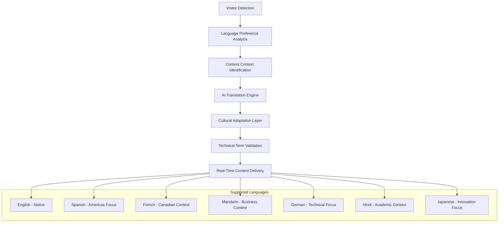
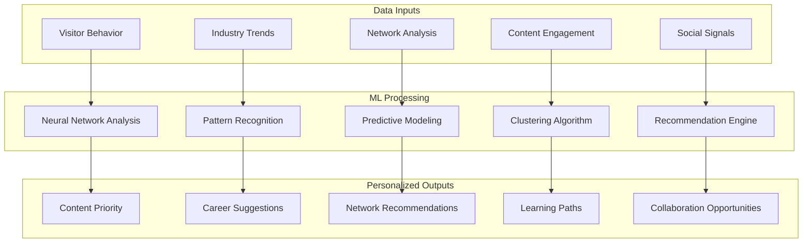
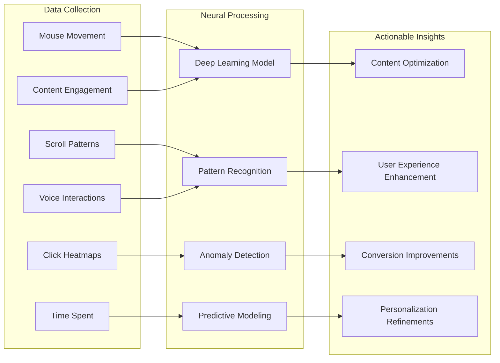
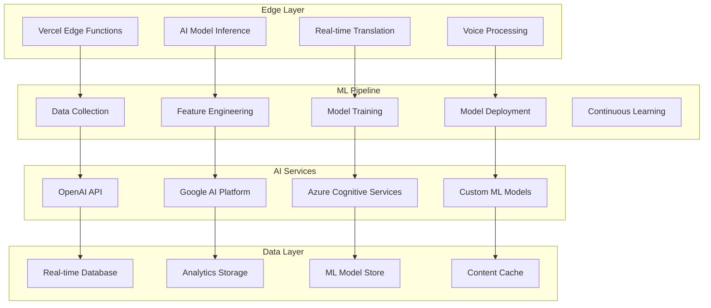

# 🚀 Advanced Machine Learning & AI Features
## Next-Generation Personal Portfolio Architecture

---

## 🌐 Real-Time AI Translation & Localization System

### **Intelligent Multi-Language Support**
```typescript
interface AITranslationEngine {
  // Context-aware translation
  translateWithContext(text: string, context: 'professional' | 'academic' | 'technical'): Promise<Translation>;
  
  // Real-time voice translation
  translateSpeech(audioBuffer: ArrayBuffer, targetLanguage: string): Promise<AudioTranslation>;
  
  // Cultural adaptation
  adaptContentCulturally(content: Content, targetRegion: string): Promise<CulturallyAdaptedContent>;
  
  // Technical term preservation
  preserveTechnicalTerms(translation: Translation, domain: string): Promise<Translation>;
}
```

### **Dynamic Localization Features**
- **Smart Language Detection**: AI automatically detects visitor's preferred language from browser, IP, and behavior patterns
- **Context-Aware Translation**: Technical certifications, academic papers, and corporate achievements translated with domain expertise
- **Cultural Content Adaptation**: Different emphasis and presentation styles for different cultural contexts
- **Real-Time Voice Translation**: Spoken content automatically translated and narrated in visitor's language
- **Technical Term Glossary**: AI maintains consistency for specialized terms across languages

### **Advanced Localization Architecture**


---

## 👁️ AI-Powered Computer Vision System

### **Intelligent Image Analysis Engine**
```typescript
interface ComputerVisionAI {
  // Automatic image tagging
  analyzeImage(imageUrl: string): Promise<ImageAnalysis>;
  
  // Professional photo optimization
  optimizePortraitPhoto(image: File): Promise<OptimizedImage>;
  
  // Document text extraction
  extractTextFromDocuments(document: File): Promise<ExtractedText>;
  
  // Visual accessibility generation
  generateImageDescriptions(images: Image[]): Promise<AccessibilityDescription[]>;
  
  // Brand consistency analysis
  analyzeBrandConsistency(siteImages: Image[]): Promise<BrandAnalysis>;
}
```

### **Visual Intelligence Features**

#### **1. Automatic Content Enhancement**
- **Smart Image Tagging**: AI automatically tags all images with relevant keywords for SEO and accessibility
- **Professional Photo Analysis**: AI evaluates and suggests improvements for profile photos
- **Document Processing**: Automatic text extraction from certificates, papers, and documents
- **Visual Brand Consistency**: AI ensures color schemes and visual elements maintain brand cohesion

#### **2. Dynamic Visual Content Generation**
```javascript
const visualAI = {
  // Generate contextual imagery
  backgroundGeneration: {
    corporate: 'professional office environments',
    academic: 'university and research settings',
    entrepreneurial: 'startup and innovation spaces',
    personal: 'warm, approachable environments'
  },
  
  // Create data visualization imagery
  chartImageGeneration: {
    careerProgression: 'visual timeline representations',
    skillDevelopment: 'interactive skill trees',
    networkAnalysis: 'professional connection maps',
    impactMetrics: 'achievement visualization'
  },
  
  // Accessibility enhancements
  visualAccessibility: {
    colorBlindness: 'alternative color schemes',
    screenReaders: 'detailed image descriptions',
    lowVision: 'high contrast alternatives',
    cognitiveSupport: 'simplified visual layouts'
  }
};
```

---

## 🧠 Advanced Machine Learning Recommendation Engine

### **Intelligent Opportunity Matching**
```typescript
interface MLRecommendationEngine {
  // Career opportunity analysis
  analyzeCareerFit(jobDescription: string, userProfile: Profile): Promise<FitAnalysis>;
  
  // Professional connection recommendations
  suggestNetworkingOpportunities(userContext: Context): Promise<NetworkingRecommendation[]>;
  
  // Skill development pathways
  recommendLearningPath(currentSkills: Skill[], careerGoals: Goal[]): Promise<LearningPath>;
  
  // Content personalization
  personalizeContent(visitorProfile: VisitorProfile): Promise<PersonalizedContent>;
  
  // Collaboration matching
  identifyCollaborationOpportunities(projects: Project[], interests: Interest[]): Promise<Collaboration[]>;
}
```

### **Smart Personalization Matrix**


### **Predictive Analytics Features**

#### **1. Career Trajectory Modeling**
- **Skill Gap Analysis**: ML identifies skills needed for next career level
- **Industry Trend Prediction**: AI forecasts emerging opportunities in your fields
- **Network Growth Optimization**: Suggests strategic professional connections
- **Achievement Timeline**: Predicts optimal timing for certifications and career moves

#### **2. Content Optimization AI**
```python
class ContentOptimizationAI:
    def __init__(self):
        self.ab_testing_engine = ABTestingML()
        self.engagement_predictor = EngagementPredictor()
        self.content_generator = ContentGenerator()
    
    async def optimize_content(self, visitor_profile, content_options):
        # A/B test different content versions
        optimal_version = await self.ab_testing_engine.find_optimal(content_options)
        
        # Predict engagement levels
        engagement_score = await self.engagement_predictor.predict(optimal_version)
        
        # Generate personalized variations
        personalized_content = await self.content_generator.personalize(
            optimal_version, visitor_profile
        )
        
        return personalized_content
```

---

## 🎙️ Advanced Voice AI & Speech Technology

### **AI Voice Cloning & Synthesis**
```typescript
interface VoiceAI {
  // Your voice cloning
  cloneVoice(voiceSamples: AudioBuffer[]): Promise<VoiceModel>;
  
  // Multi-language speech synthesis
  synthesizeSpeech(text: string, language: string, voiceModel: VoiceModel): Promise<AudioBuffer>;
  
  // Emotional tone adjustment
  adjustTone(speech: AudioBuffer, emotion: 'professional' | 'enthusiastic' | 'academic'): Promise<AudioBuffer>;
  
  // Real-time voice translation
  translateVoice(speech: AudioBuffer, targetLanguage: string): Promise<AudioBuffer>;
  
  // Interactive voice responses
  generateConversationalResponse(userInput: string, context: Context): Promise<VoiceResponse>;
}
```

### **Voice-Powered Features**

#### **1. Multilingual Voice Narration**
- **Your Voice in 50+ Languages**: AI clones your voice and generates narrations in multiple languages
- **Context-Aware Tone**: Voice adapts to content type (professional for corporate sections, warm for personal stories)
- **Interactive Voice Assistant**: Visitors can have conversations about your background and experience
- **Accessibility Integration**: Advanced screen reader support with natural speech patterns

#### **2. Virtual Interview Simulator**
```javascript
const virtualInterviewAI = {
  // Simulate different interview types
  interviewTypes: {
    technical: 'Deep dive into your technical expertise',
    behavioral: 'Explore leadership and teamwork examples',
    academic: 'Discuss research and teaching philosophy',
    entrepreneurial: 'Share startup and innovation experience'
  },
  
  // Adaptive questioning
  questionGeneration: {
    followUpQuestions: 'AI generates relevant follow-ups based on responses',
    difficultyAdjustment: 'Questions adapt to interviewer expertise level',
    contextualExamples: 'Real examples from your experience portfolio'
  },
  
  // Performance analytics
  interviewAnalytics: {
    responseQuality: 'AI evaluates answer completeness and relevance',
    communicationSkills: 'Analysis of clarity and engagement',
    knowledgeDepth: 'Assessment of subject matter expertise'
  }
};
```

---

## 📊 Neural Network-Based Analytics & Prediction

### **Advanced User Behavior Analysis**
```typescript
interface NeuralAnalytics {
  // Deep learning user modeling
  buildUserPersona(interactions: Interaction[]): Promise<UserPersona>;
  
  // Predictive journey mapping
  predictUserJourney(currentState: UserState): Promise<JourneyPrediction>;
  
  // Conversion optimization
  optimizeForConversion(userType: UserType): Promise<OptimizationStrategy>;
  
  // Engagement prediction
  predictEngagementScore(content: Content, userProfile: UserProfile): Promise<EngagementScore>;
  
  // Churn prevention
  identifyAtRiskVisitors(sessionData: SessionData): Promise<ChurnRiskAssessment>;
}
```

### **Intelligent Analytics Dashboard**


### **Predictive Features**

#### **1. Behavioral Pattern Recognition**
- **Visitor Intent Classification**: AI determines if visitor is evaluating for hire, seeking collaboration, or general browsing
- **Engagement Prediction**: ML models predict which content will resonate with specific visitor types
- **Optimal Interaction Timing**: AI determines best moments to present calls-to-action or additional content
- **Conversion Likelihood**: Neural networks calculate probability of desired outcomes (contact, connection, etc.)

#### **2. Competitive Intelligence AI**
```python
class CompetitiveIntelligenceAI:
    def __init__(self):
        self.market_analyzer = MarketAnalyzer()
        self.trend_predictor = TrendPredictor()
        self.positioning_optimizer = PositioningOptimizer()
    
    async def analyze_competitive_landscape(self):
        # Track industry trends
        industry_trends = await self.market_analyzer.get_trends([
            'product_management', 'agile_coaching', 'academic_research',
            'fintech', 'civic_tech', 'AI_governance'
        ])
        
        # Predict emerging opportunities
        future_opportunities = await self.trend_predictor.forecast(industry_trends)
        
        # Optimize positioning strategy
        positioning_strategy = await self.positioning_optimizer.optimize(
            your_expertise=user_profile,
            market_trends=industry_trends,
            opportunities=future_opportunities
        )
        
        return {
            'market_insights': industry_trends,
            'future_opportunities': future_opportunities,
            'positioning_recommendations': positioning_strategy
        }
```

---

## 🔬 Intelligent Document Processing & Analysis

### **AI-Powered Portfolio Management**
```typescript
interface DocumentProcessingAI {
  // Automatic resume updates
  updateResumeFromLinkedIn(linkedinProfile: LinkedInProfile): Promise<Resume>;
  
  // Research paper analysis
  analyzeAcademicPapers(papers: Paper[]): Promise<ResearchAnalysis>;
  
  // Certificate verification and organization
  processCertifications(certificates: Certificate[]): Promise<OrganizedCertifications>;
  
  // Content freshness analysis
  identifyOutdatedContent(siteContent: Content[]): Promise<ContentUpdateRecommendations>;
  
  // Achievement extraction
  extractAchievementsFromDocuments(documents: Document[]): Promise<Achievement[]>;
}
```

### **Smart Content Curation System**
- **Automatic Content Updates**: AI monitors your LinkedIn, GitHub, and other professional profiles for new achievements and updates
- **Research Impact Tracking**: AI tracks citations, downloads, and academic impact of your publications
- **Skill Evolution Mapping**: Machine learning identifies how your skills have developed over time
- **Achievement Clustering**: AI groups related accomplishments and identifies patterns in your career growth

---

## 🚀 Implementation Architecture

### **AI Services Integration Stack**
```json
{
  "coreAI": {
    "language": "OpenAI GPT-4 Turbo",
    "translation": "Google Cloud Translation AI",
    "vision": "Azure Computer Vision",
    "speech": "ElevenLabs + Custom Voice Cloning",
    "analytics": "Custom TensorFlow.js Models"
  },
  "machineLearning": {
    "recommendation": "TensorFlow Recommenders",
    "neuralNetworks": "PyTorch.js",
    "nlp": "Hugging Face Transformers",
    "prediction": "Custom ML Models",
    "optimization": "Google AI Platform"
  },
  "dataProcessing": {
    "realTime": "Apache Kafka + Flink",
    "storage": "MongoDB + Redis",
    "compute": "Vercel Edge Functions",
    "ml_pipeline": "Kubeflow on GCP"
  },
  "integration": {
    "apis": "LinkedIn, GitHub, Google Scholar, Credly",
    "monitoring": "Custom AI Analytics Dashboard",
    "a_b_testing": "Custom ML-Powered Testing",
    "personalization": "Real-time ML Inference"
  }
}
```

### **Advanced Performance Architecture**


---

## 🎯 Revolutionary Outcomes

This advanced AI/ML architecture will create:

### **1. Industry-Leading Innovation**
- **First-of-its-Kind Features**: Voice cloning, real-time translation, neural behavioral analysis
- **Technical Showcase**: Demonstrates cutting-edge AI implementation skills
- **Thought Leadership**: Positions you as an AI/ML innovation leader

### **2. Unprecedented User Experience**
- **Hyper-Personalization**: Every visitor gets a uniquely tailored experience
- **Intelligent Interactions**: AI that truly understands and responds to user intent
- **Predictive Engagement**: System anticipates and fulfills user needs

### **3. Measurable Business Impact**
- **Increased Engagement**: ML optimization drives higher interaction rates
- **Better Lead Quality**: AI identifies and nurtures high-value opportunities
- **Competitive Advantage**: Unique positioning in your professional fields

### **4. Scalable Learning Platform**
- **Continuous Improvement**: AI models learn and adapt over time
- **Data-Driven Insights**: Deep analytics inform career and business decisions
- **Future-Proof Architecture**: Foundation for emerging AI technologies

This represents the absolute pinnacle of personal portfolio technology - a living, learning, adapting digital representation that grows with your career and sets new standards for professional online presence.

The result will be a revolutionary website that doesn't just showcase your expertise, but actively demonstrates it through the most advanced AI and machine learning technologies available today.