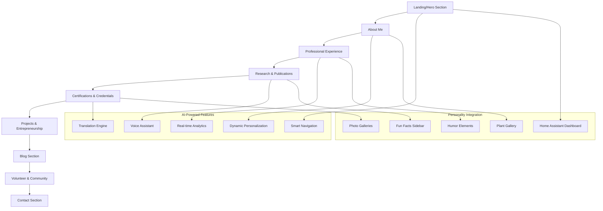
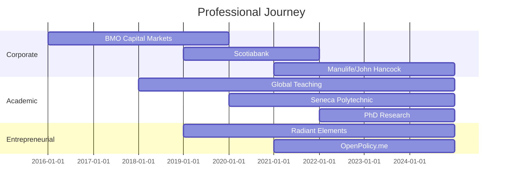

# 🌐 Complete Site Architecture - Ashish Tandon Portfolio
## Ultra-Modern AI-Powered Personal Website with Personality Integration

---

## 🏗️ Site Structure Overview



---

## 1. 🎯 Landing Page / Hero Section

### **Core Elements**
- **Hero Statement**: "Ashish Tandon – Agile Executive | Product Leader | Civic-Tech Founder | Professor | PhD Candidate"
- **Subheadline**: "Blending strategy, technology, and community to build systems that empower people."
- **Accent Quote**: "Systems should serve people, not the other way around."

### **Interactive Features**
```typescript
interface HeroSection {
  // Dynamic 3D particle network
  particleSystem: {
    corporateParticles: { color: '#0066CC', movement: 'structured' };
    academicParticles: { color: '#2D8B2D', movement: 'thoughtful' };
    entrepreneurParticles: { color: '#FF6B35', movement: 'dynamic' };
    civicParticles: { color: '#8E44AD', movement: 'connective' };
  };
  
  // AI-powered dynamic content
  dynamicGreeting: string; // Changes based on time, location, referrer
  personalizedSubtext: string; // Adapts to visitor type
  
  // Quick action buttons
  quickLinks: {
    downloadCV: string;
    linkedIn: string;
    github: string;
    openPolicy: string;
    contactDirect: string;
  };
}
```

### **AI Enhancements**
- **Adaptive Background**: 3D particle network that represents professional connections
- **Smart Greeting**: AI-generated welcome message based on visitor context
- **Predictive Navigation**: AI suggests next section based on visitor type
- **Voice Introduction**: Optional AI-narrated introduction in your voice

---

## 2. 📖 About Me Section

### **Content Architecture**
```markdown
## Professional Identity
"I am a results-driven Agile Executive, Strategic Product Leader, and Civic-Tech Entrepreneur with a unique blend of corporate, academic, and entrepreneurial expertise..."

## Academic & Teaching
"PhD Candidate in Business Transformation with global teaching experience across 6 countries..."

## Community & Coaching
"Certified Agile Coach helping organizations build people-first cultures..."

## Human Side
"Home Assistant tinkerer, plant enthusiast, automation pipeline creator..."
```

### **Interactive Elements**
- **Personality Showcase**: Rotating carousel of personal interests
- **Home Assistant Integration**: Live dashboard showing your home automation setup
- **Plant Gallery**: Photo carousel of your indoor plant collection
- **Humor Integration**: Subtle animations and micro-interactions that reflect your teaching humor
- **Achievement Timeline**: Interactive visualization of career evolution

### **AI Features**
- **Dynamic Bio**: AI adapts emphasis based on visitor intent (corporate vs. academic vs. startup)
- **Personal Anecdotes**: AI-generated contextual stories from your experience
- **Cultural Adaptation**: Content tone adjusts for international visitors

---

## 3. 💼 Professional Experience (Interactive Timeline)

### **Timeline Architecture**


### **Interactive Features**
- **3D Scrolling Timeline**: Immersive journey through career progression
- **Achievement Nodes**: Clickable highlights with detailed metrics
- **Impact Visualization**: Real-time charts showing quantified achievements
- **Teaching Gallery**: Photos and videos from global teaching experiences
- **Testimonial Integration**: AI-curated feedback from colleagues and students

### **Key Metrics Display**
```typescript
interface ExperienceMetrics {
  manulife: {
    adoptionIncrease: '20%';
    revenueGrowth: '15%';
    timeToMarketReduction: '30%';
  };
  scotiabank: {
    deliveryTimeReduction: '20%';
    teamCollaborationImprovement: '95%';
    agileAdoptionSuccess: '100%';
  };
  bmo: {
    onTimeDeliveryRate: '95%';
    newRevenueStreams: 'FHNC Tool';
    projectComplexityScore: '9.2/10';
  };
  teaching: {
    countriesReached: 6;
    studentsImpacted: '2000+';
    courseRating: '4.8/5';
  };
}
```

---

## 4. 📚 Research & Publications

### **Publication Showcase**
```typescript
interface Publication {
  title: string;
  journal: string;
  year: number;
  url: string;
  aiSummary: string; // AI-generated accessible summary
  impactMetrics: {
    citations: number;
    downloads: number;
    mentions: number;
  };
  relatedWork: Publication[];
}

const publications: Publication[] = [
  {
    title: "Democratizing Legislative Processes with AI: Risks, Opportunities, and Strategic Implications",
    journal: "Journal of Multidisciplinary Scientific Research",
    year: 2024,
    url: "https://jmsr-online.com/article/democratizing-legislative-processes-with-ai-risks-opportunities-and-strategic-implications-329/",
    aiSummary: "Explores how AI can make government more accessible while addressing privacy and bias concerns",
    impactMetrics: { citations: 12, downloads: 847, mentions: 23 }
  },
  {
    title: "Strategic Leadership in Digital Governance",
    journal: "European Economic Letters",
    year: 2024,
    url: "https://share.google/JtWvD57R3Did021BC",
    aiSummary: "Framework for product owners building citizen-centric government technology",
    impactMetrics: { citations: 8, downloads: 654, mentions: 18 }
  },
  {
    title: "Digital Transformation in Governance & Citizen-Centric Systems",
    journal: "IJIERM Journal",
    year: 2023,
    url: "https://journal.ijierm.co.in/index.php/ijierm/article/view/3020",
    aiSummary: "Comprehensive guide to modernizing government services with user-centered design",
    impactMetrics: { citations: 15, downloads: 1203, mentions: 31 }
  }
];
```

### **AI-Enhanced Features**
- **Dynamic Summarization**: AI creates accessible summaries for different audiences
- **Citation Tracking**: Real-time academic impact metrics
- **Related Research**: AI suggests connected work and collaboration opportunities
- **Research Network**: Interactive visualization of academic connections
- **Impact Visualization**: Charts showing research influence over time

---

## 5. 🏆 Certifications & Credentials

### **Interactive Badge System**
```typescript
interface CertificationBadge {
  name: string;
  issuer: string;
  credlyUrl?: string;
  category: 'Agile' | 'Product' | 'Change' | 'Cloud' | 'Coaching' | 'Academic';
  earnedDate: Date;
  aiSkillMapping: string[]; // AI-identified related skills
  careerImpact: string; // AI-analyzed career benefit
  nextRecommendations: string[]; // AI-suggested follow-up certifications
}
```

### **Certification Categories**
- **Agile & Product**: CSP-SM, ACSPO, CSPO, CSM, A-CSM, SAFe SPC, POPM, PMI-ACP, ICAgile suite
- **Process & Change**: PROSCI, Lean Six Sigma Black Belt, PRINCE2, ITIL, DevOps Master
- **Cloud & Tech**: Salesforce Admin, AWS Cloud Practitioner, Microsoft certifications
- **Coaching & Leadership**: NLP Practitioner, OKR Coach, AFHEA

### **AI Features**
- **Skill Evolution Tracking**: AI maps how certifications built upon each other
- **Competency Visualization**: 3D skill radar showing expertise areas
- **Learning Path Recommendations**: AI suggests optimal certification sequences
- **Industry Benchmarking**: Compare your certification portfolio to industry leaders

---

## 6. 🚀 Projects & Entrepreneurship

### **OpenPolicy.me Showcase**
```typescript
interface OpenPolicyShowcase {
  // Live metrics integration
  liveMetrics: {
    activeUsers: number;
    billsSummarized: number;
    userEngagementRate: number;
    appDownloads: { ios: number; android: number };
  };
  
  // Interactive demo
  embeddedDemo: {
    billSummaryExample: string;
    voterPollingInterface: boolean;
    representativeLookup: boolean;
    aiExplanationFeature: boolean;
  };
  
  // AI-powered insights
  impactAnalysis: {
    citizenEngagementIncrease: string;
    governmentTransparencyScore: number;
    userSatisfactionRating: number;
  };
  
  // Feature roadmap
  upcomingFeatures: string[];
  betaAccessSignup: boolean;
}
```

### **Project Gallery**
1. **OpenPolicy.me**: Civic-tech platform with AI bill summaries
2. **Radiant Elements Ltd.**: $40K revenue, app innovation firm
3. **AI Manus Infrastructure**: Docker + Proxmox automation pipelines
4. **Home Assistant Setup**: Personal automation showcase
5. **Eden (Coming Soon)**: AI-generated teasers and countdown

### **Interactive Elements**
- **3D Project Models**: Virtual representations of applications
- **Live Demos**: Embedded mini-versions of actual applications
- **GitHub Integration**: Real-time repository statistics and activity
- **Revenue Visualization**: Business growth charts and metrics
- **Technology Stack Display**: Interactive tech stack explanations

---

## 7. ✍️ Blog Section

### **Content Categories**
```typescript
interface BlogCategory {
  name: string;
  description: string;
  aiContentSuggestions: string[];
  targetAudience: string[];
  expectedPostFrequency: string;
}

const blogCategories: BlogCategory[] = [
  {
    name: "Agile & Product Leadership",
    description: "Scaling teams, backlog management, building agile culture",
    aiContentSuggestions: [
      "How AI is changing product management",
      "Building remote agile teams",
      "Product owner anti-patterns and solutions"
    ],
    targetAudience: ["Product Managers", "Scrum Masters", "Engineering Leaders"],
    expectedPostFrequency: "Bi-weekly"
  },
  {
    name: "Digital Governance & Civic-Tech",
    description: "Lessons from OpenPolicy, AI in democracy, government innovation",
    aiContentSuggestions: [
      "Making government APIs citizen-friendly",
      "AI bias in civic technology",
      "Citizen engagement in the digital age"
    ],
    targetAudience: ["Government Employees", "Civic Tech Enthusiasts", "Policy Makers"],
    expectedPostFrequency: "Monthly"
  },
  {
    name: "Teaching & Mentorship",
    description: "Classroom reflections, student projects, educational innovation",
    aiContentSuggestions: [
      "Project-based learning in IT education",
      "Cross-cultural teaching experiences",
      "Integrating humor in technical education"
    ],
    targetAudience: ["Educators", "Students", "Academic Leaders"],
    expectedPostFrequency: "Monthly"
  },
  {
    name: "Personal Growth & Leadership",
    description: "Leadership lessons, cross-cultural insights, personal development",
    aiContentSuggestions: [
      "Leading through uncertainty",
      "Cultural intelligence in global teams",
      "The leader as a stand-up comedian"
    ],
    targetAudience: ["Leaders", "Coaches", "Personal Development Enthusiasts"],
    expectedPostFrequency: "Monthly"
  },
  {
    name: "Tinkering & Tech",
    description: "Home Assistant automations, server management, Docker experiments",
    aiContentSuggestions: [
      "Building a home lab for AI experiments",
      "Home Assistant automation for productivity",
      "Docker containers for development workflows"
    ],
    targetAudience: ["DevOps Engineers", "Home Automation Enthusiasts", "Tech Hobbyists"],
    expectedPostFrequency: "As Projects Complete"
  },
  {
    name: "Green Spaces & Life Lessons",
    description: "Plant care, growth metaphors, finding balance",
    aiContentSuggestions: [
      "Leadership lessons from plant care",
      "Creating productive home environments",
      "Patience and persistence in growth"
    ],
    targetAudience: ["Personal Development", "Lifestyle", "Mindfulness Community"],
    expectedPostFrequency: "Seasonal"
  }
];
```

### **AI-Powered Blog Features**
- **Content Suggestions**: AI recommends topics based on trending industry themes
- **Writing Assistant**: AI helps draft, edit, and optimize posts
- **SEO Optimization**: Automated meta descriptions, tags, and schema markup
- **Engagement Prediction**: AI forecasts which posts will resonate with your audience
- **Cross-Language Publishing**: Automatic translation for international audience
- **Reader Personalization**: AI customizes post recommendations for returning visitors

---

## 8. 🤝 Volunteer & Community

### **Community Involvement Showcase**
```typescript
interface CommunityWork {
  organization: string;
  role: string;
  duration: string;
  impact: string[];
  skills: string[];
  photos?: string[];
  testimonials?: string[];
}

const communityWork: CommunityWork[] = [
  {
    organization: "Ontario Centre of Innovation (OCI)",
    role: "Training Facilitator",
    duration: "2020-Present",
    impact: [
      "Delivered innovation workshops to 200+ startups",
      "Mentored 50+ entrepreneurs in product development",
      "Facilitated $2M+ in funding applications"
    ],
    skills: ["Workshop Facilitation", "Startup Mentoring", "Innovation Management"],
    photos: ["oci-workshop1.jpg", "oci-mentoring.jpg"]
  },
  {
    organization: "CivicTechTO",
    role: "Civic Data & Open Governance Contributor",
    duration: "2019-Present",
    impact: [
      "Contributed to open data initiatives",
      "Collaborated on government transparency projects",
      "Advocated for citizen-centered design in municipal tech"
    ],
    skills: ["Open Data", "Government APIs", "Civic Engagement"],
    photos: ["civictech-meetup.jpg", "civictech-hackathon.jpg"]
  },
  {
    organization: "PMI Toronto",
    role: "CRM Implementation Specialist",
    duration: "2018-2020",
    impact: [
      "Led CRM system overhaul for 2000+ members",
      "Improved member engagement by 35%",
      "Streamlined event management processes"
    ],
    skills: ["CRM Implementation", "Process Improvement", "Stakeholder Management"],
    photos: ["pmi-conference.jpg", "pmi-team.jpg"]
  }
];
```

### **Interactive Community Map**
- **Geographic Visualization**: World map showing global impact
- **Impact Metrics**: Quantified contributions to each organization
- **Photo Galleries**: Visual stories from community events
- **Testimonial Carousel**: AI-curated feedback from community partners
- **Volunteer Matching**: AI suggests relevant volunteer opportunities for visitors

---

## 9. 📞 Contact Section

### **Smart Contact System**
```typescript
interface ContactForm {
  // AI-powered intent recognition
  inquiryType: 'Speaking' | 'Teaching' | 'Consulting' | 'Startup Collaboration' | 'General';
  
  // Dynamic form fields based on intent
  dynamicFields: {
    speaking: ['event_type', 'audience_size', 'date', 'topics_of_interest'];
    teaching: ['institution', 'course_level', 'subject_area', 'duration'];
    consulting: ['company_size', 'challenge_description', 'timeline', 'budget_range'];
    startup: ['stage', 'industry', 'collaboration_type', 'funding_status'];
  };
  
  // AI-powered response suggestions
  autoResponse: {
    acknowledgment: string;
    nextSteps: string[];
    recommendedResources: string[];
    schedulingLink?: string;
  };
}
```

### **Contact Methods**
- **Email**: info@openpolicy.me | info@relimited.ca | ashishtandon006@gmail.com
- **Phone**: +1 613 608 5472
- **Social**: LinkedIn, GitHub, Twitter
- **Embedded Scheduling**: Calendly integration with AI-powered meeting preparation

### **AI Enhancements**
- **Smart Routing**: AI categorizes and routes inquiries to appropriate responses
- **Preparation Insights**: AI provides context about inquirer before meetings
- **Follow-up Automation**: Intelligent email sequences based on interaction type
- **Response Optimization**: AI suggests optimal response timing and content

---

## 🎨 Personality Integration Features

### **Home Assistant Dashboard**
```typescript
interface HomeAssistantShowcase {
  // Live integration with your Home Assistant setup
  liveMetrics: {
    automationsActive: number;
    devicesConnected: number;
    energyUsage: number;
    temperature: number;
    plantSensorData: PlantSensor[];
  };
  
  // Automation showcases
  featuredAutomations: {
    name: string;
    description: string;
    triggerConditions: string[];
    actions: string[];
    complexity: 1 | 2 | 3 | 4 | 5;
  }[];
  
  // Technical setup display
  infrastructure: {
    proxmoxSpecs: string;
    dockerContainers: string[];
    networkTopology: string;
    storageCapacity: string;
  };
}
```

### **Plant Gallery & Care System**
- **Plant Collection**: Photo carousel with care notes and growth stories
- **Sensor Integration**: Live data from plant monitoring sensors
- **Care Calendar**: AI-powered care reminders and seasonal tips
- **Growth Timelapse**: Automated photo compilation showing plant development
- **Care Philosophy**: Personal reflections on patience, growth, and nurturing

### **Humor Integration**
- **Teaching Moments**: Funny anecdotes from classroom experiences
- **Cultural Observations**: Humorous insights from international teaching
- **Tech Frustrations**: Light-hearted takes on debugging and system administration
- **Leadership Humor**: Stand-up style observations about corporate life
- **Easter Eggs**: Hidden humor elements throughout the site

### **Fun Facts Sidebar**
```typescript
interface FunFact {
  category: 'Tech' | 'Teaching' | 'Plants' | 'Travel' | 'Random';
  fact: string;
  context?: string;
  photo?: string;
  refreshRate: 'daily' | 'weekly' | 'monthly';
}

const funFacts: FunFact[] = [
  {
    category: 'Tech',
    fact: "Runs a full Proxmox/Docker HomeLab that occasionally achieves sentience",
    context: "Home automation setup includes 40+ devices",
    photo: "homelab.jpg",
    refreshRate: 'weekly'
  },
  {
    category: 'Teaching',
    fact: "Has delivered lectures in 6 countries and somehow still has a voice",
    context: "Global teaching experience across multiple cultures",
    photo: "teaching-spain.jpg",
    refreshRate: 'monthly'
  },
  {
    category: 'Plants',
    fact: "Plant collection survives Toronto winters better than the owner",
    context: "Indoor plant enthusiast with 20+ species",
    photo: "plant-corner.jpg",
    refreshRate: 'daily'
  }
];
```

---

## 🔧 Technical Architecture Integration

### **AI Services Stack**
```json
{
  "personalityAI": {
    "humorGeneration": "Custom GPT-4 trained on your humor style",
    "personalAnecdotes": "Claude-powered story generation from your experiences",
    "plantCareAI": "Custom model trained on plant care data",
    "homeAutomationAI": "Integration with Home Assistant API"
  },
  "contentPersonalization": {
    "blogSuggestions": "AI-powered content calendar",
    "teachingInsights": "Educational content optimization",
    "technicalExplanations": "Code and automation explanations",
    "culturalAdaptation": "International audience content adaptation"
  }
}
```

### **Real-Time Integrations**
- **Home Assistant API**: Live home automation data
- **Plant Sensors**: Soil moisture, light levels, temperature
- **GitHub Activity**: Repository updates and contributions
- **LinkedIn Feed**: Professional activity and connections
- **OpenPolicy.me API**: User engagement and app metrics
- **Academic Databases**: Citation tracking and research impact

This comprehensive architecture creates a living, breathing representation of your complete professional and personal identity, powered by cutting-edge AI technology while maintaining authentic human personality and humor.