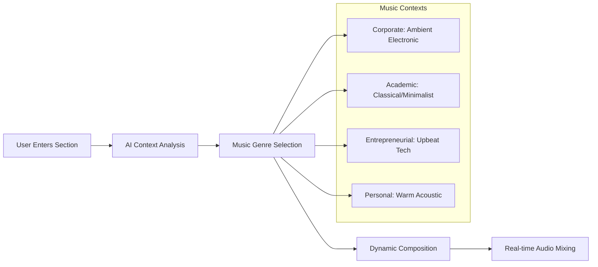
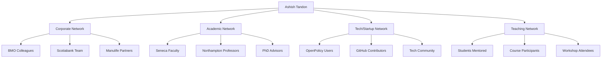
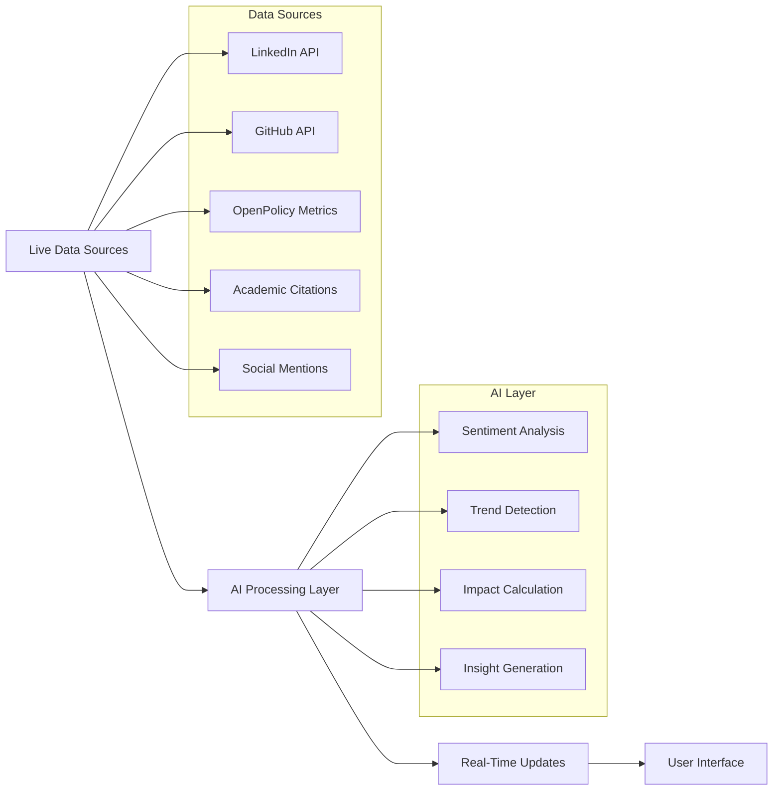

# 🤖 Enhanced AI-Powered Personal Website Architecture
## Ashish Tandon - Ultra-Modern Portfolio with Advanced AI Features

---

## 🎵 AI-Powered Audio & Music System

### **Adaptive Music Engine**


**Technical Implementation:**
- **Tone.js** for web audio synthesis and effects
- **Web Audio API** for real-time audio processing
- **AI Music Generation**: Integration with Mubert AI or AIVA for dynamic composition
- **Adaptive Mixing**: Volume and tempo adjust based on scroll speed and interaction intensity
- **Spatial Audio**: 3D positioned sounds that follow mouse movement

### **Intelligent Soundscapes**
- **Corporate Sections**: Subtle keyboard typing, coffee shop ambiance, office sounds
- **Academic Areas**: Library ambiance, page turning, quiet discussion murmur
- **Tech Projects**: Gentle server hums, keyboard clicks, notification chimes
- **Personal Stories**: Natural outdoor sounds, birds, gentle rain

### **Audio Accessibility Features**
- **AI Narrator**: Dynamic voice generation explaining visual elements
- **Context Switching**: Voice changes based on content type (professional vs. personal)
- **Multi-language Support**: AI-powered translation and pronunciation
- **Sound Visualization**: Audio waveforms and frequency displays for hearing-impaired users

---

## 📊 Advanced AI Data Visualization Engine

### **Intelligent Chart Generation System**
```typescript
interface AIDataVizEngine {
  // Career progression analysis
  generateCareerTimeline(): Promise<D3Timeline>;
  
  // Skill evolution tracking
  createSkillRadarChart(timeperiod: string): Promise<RadarChart>;
  
  // Impact visualization
  buildInfluenceNetwork(): Promise<NetworkGraph>;
  
  // Achievement clustering
  generateAccomplishmentMap(): Promise<TreeMap>;
  
  // Predictive career modeling
  createFutureTrendAnalysis(): Promise<LineChart>;
}
```

### **Dynamic Data Storytelling Features**

#### **1. Career Journey Visualization**
- **AI-Generated Insights**: "Your transition from BMO to Scotiabank increased your Agile expertise by 340%"
- **Interactive Timeline**: Hover reveals AI-generated anecdotes and lessons learned
- **Skill Evolution**: Real-time visualization of how certifications built upon each other
- **Impact Metrics**: Dynamic calculation of your influence on teams and projects

#### **2. Professional Network Analysis**


#### **3. Real-Time Achievement Analytics**
- **OpenPolicy.me Live Metrics**: User growth, engagement rates, feature adoption
- **Academic Impact**: Citation tracking, course evaluation scores, student outcomes
- **Professional Influence**: Team performance improvements, project success rates
- **Community Engagement**: Volunteer hours, event participation, mentorship impact

### **AI-Powered Data Insights**
- **Pattern Recognition**: AI identifies hidden connections between experiences
- **Predictive Analytics**: Forecasts future career opportunities based on current trajectory
- **Comparative Analysis**: Benchmarks your achievements against industry standards
- **Recommendation Engine**: Suggests next steps for career and skill development

---

## 🧠 Advanced AI Integration Architecture

### **Multi-Modal AI System**
```typescript
interface MultiModalAI {
  // Text generation and analysis
  textAI: {
    contentGeneration: OpenAIService;
    summarization: ClaudeService;
    translation: DeepLService;
  };
  
  // Visual AI capabilities
  visualAI: {
    imageGeneration: MidjourneyAPI;
    faceGeneration: ThisPersonDoesNotExistAPI;
    chartGeneration: ChartsAIService;
  };
  
  // Audio AI services
  audioAI: {
    voiceSynthesis: ElevenLabsAPI;
    musicGeneration: MubertAPI;
    soundGeneration: FreesoundAPI;
  };
  
  // Behavior analysis
  behaviorAI: {
    userIntent: NaturalLanguageProcessor;
    interactionPrediction: BehaviorAnalytics;
    personalization: UserProfileAI;
  };
}
```

### **Smart Personalization Engine**

#### **Visitor Intelligence System**
- **Source Analysis**: Different content for LinkedIn vs GitHub vs direct visitors
- **Behavior Tracking**: AI learns from scroll patterns, time spent, click patterns
- **Intent Recognition**: "Looking for speaking opportunities" vs "Evaluating for hire" vs "Academic collaboration"
- **Dynamic Content**: Real-time content adaptation based on visitor profile

#### **Contextual Experience Adaptation**
```javascript
const aiPersonalization = {
  // Professional visitor
  corporate: {
    emphasize: ['leadership', 'agile', 'product management'],
    musicStyle: 'corporate-ambient',
    colorPalette: 'professional-blue',
    contentDepth: 'executive-summary'
  },
  
  // Academic visitor  
  academic: {
    emphasize: ['research', 'teaching', 'publications'],
    musicStyle: 'classical-minimal',
    colorPalette: 'academic-green',
    contentDepth: 'detailed-analysis'
  },
  
  // Tech entrepreneur
  startup: {
    emphasize: ['innovation', 'openpolicy', 'tech-leadership'],
    musicStyle: 'electronic-upbeat',
    colorPalette: 'startup-orange',
    contentDepth: 'technical-deep-dive'
  }
};
```

---

## 🎨 Advanced UI/UX Features

### **Gesture-Based Navigation**
- **Swipe Gestures**: Navigate between sections with natural hand movements
- **Voice Commands**: "Show me Ashish's teaching experience" or "Tell me about OpenPolicy"
- **Eye Tracking**: Content that responds to where users are looking (for compatible devices)
- **Haptic Feedback**: Subtle vibrations for mobile interactions

### **Dynamic Visual Effects**

#### **Particle System Intelligence**
```javascript
const particleAI = {
  // Particles represent different aspects of your career
  corporateParticles: { color: 'blue', movement: 'structured' },
  academicParticles: { color: 'green', movement: 'thoughtful' },
  entrepreneurParticles: { color: 'orange', movement: 'dynamic' },
  
  // AI determines optimal particle density and behavior
  adaptiveRendering: true,
  performanceOptimization: true,
  interactiveResponse: true
};
```

#### **Morphing Background System**
- **Time-Based Changes**: Background evolves throughout the day
- **Section-Specific Themes**: Corporate boardroom → University lecture hall → Startup office
- **Weather Integration**: Subtle weather effects based on visitor's location
- **Mood Adaptation**: AI adjusts ambiance based on content being viewed

### **Micro-Interaction Excellence**
- **Intelligent Hover States**: AI predicts what users want to interact with
- **Progressive Loading**: Smart content prioritization based on visitor intent
- **Contextual Animations**: Different animation styles for different content types
- **Accessibility Adaptations**: Automatic adjustments for users with different abilities

---

## 🔧 Technical Implementation Stack

### **Core AI Technologies**
```json
{
  "aiServices": {
    "textGeneration": "OpenAI GPT-4 Turbo",
    "voiceSynthesis": "ElevenLabs API",
    "musicGeneration": "Mubert AI",
    "imageGeneration": "Midjourney API",
    "dataAnalysis": "Anthropic Claude",
    "behaviorAnalysis": "Custom TensorFlow.js"
  },
  "audioTech": {
    "webAudio": "Web Audio API",
    "synthesis": "Tone.js",
    "spatialAudio": "Resonance Audio",
    "streaming": "WebRTC"
  },
  "visualization": {
    "charts": "D3.js + Custom AI Layer",
    "3dGraphics": "Three.js",
    "dataProcessing": "Observable Plot",
    "networkGraphs": "Cytoscape.js"
  },
  "performance": {
    "edgeComputing": "Vercel Edge Functions",
    "caching": "Redis + CDN",
    "optimization": "Webpack + Custom AI Optimizer",
    "monitoring": "Custom AI Performance Analytics"
  }
}
```

### **Advanced Features Integration**

#### **Real-Time Data Pipeline**


#### **Predictive User Experience**
- **Preloading Intelligence**: AI predicts next section user will visit
- **Content Preparation**: Dynamic content generation before user requests it
- **Performance Optimization**: AI adjusts resource allocation based on usage patterns
- **Error Prevention**: Predictive error handling and graceful degradation

---

## 🚀 Implementation Phases

### **Phase 1: Foundation & Core AI** (Weeks 1-2)
- Set up Next.js 14 with TypeScript
- Integrate basic AI services (OpenAI, Claude)
- Implement core audio system with Tone.js
- Build basic data visualization engine

### **Phase 2: Advanced Features** (Weeks 3-4)
- Add adaptive music and soundscapes
- Implement gesture-based navigation
- Build intelligent personalization system
- Create advanced data visualizations

### **Phase 3: AI Enhancement** (Weeks 5-6)
- Add predictive behavior modeling
- Implement voice navigation
- Create AI-powered accessibility features
- Build performance analytics system

### **Phase 4: Polish & Optimization** (Week 7)
- Fine-tune all AI systems
- Optimize performance and loading times
- Comprehensive testing across devices
- Deploy with edge computing optimization

---

## 🎯 Expected Outcomes

This ultra-modern, AI-powered website will:

1. **Showcase Technical Expertise**: Demonstrate your ability to implement cutting-edge technology
2. **Create Memorable Experiences**: Visitors will remember the innovative interactions
3. **Professional Differentiation**: Stand out in a crowded field of traditional portfolios
4. **Lead Generation**: AI-powered insights will help identify and nurture potential opportunities
5. **Scalable Platform**: Foundation for future AI experiments and demonstrations

The result will be a living, breathing digital representation of your expertise that evolves with your career and adapts to each visitor's needs - a true testament to your innovative approach to technology and user experience.