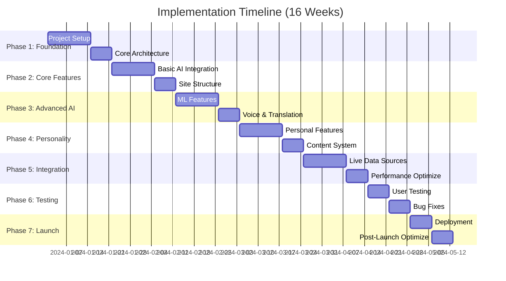

# 🚀 Implementation Phases & Detailed Todo Lists
## Ashish Tandon Portfolio - 7-Phase Implementation Strategy

---

## 📋 Phase Overview



---

## 🏗️ **PHASE 1: Foundation & Core Setup** (Weeks 1-3)

### **Week 1: Project Infrastructure**

#### **Day 1-2: Next.js 14 Project Setup**
- [ ] Initialize Next.js 14 project with App Router
- [ ] Configure TypeScript with strict mode
- [ ] Set up ESLint and Prettier with custom rules
- [ ] Configure Tailwind CSS with custom design system
- [ ] Install and configure core dependencies:
  - [ ] `framer-motion` for animations
  - [ ] `three` and `@react-three/fiber` for 3D graphics
  - [ ] `@react-three/drei` for 3D utilities
  - [ ] `zustand` for state management
  - [ ] `react-query` for data fetching
  - [ ] `next-intl` for internationalization

#### **Day 3-4: Design System Foundation**
- [ ] Create color palette (blue/green civic-tech theme)
- [ ] Design typography scale and font loading
- [ ] Build component library foundation:
  - [ ] Button variants (primary, secondary, ghost)
  - [ ] Input components with validation
  - [ ] Card layouts with hover effects
  - [ ] Loading states and skeleton screens
- [ ] Set up responsive breakpoint system
- [ ] Create animation utility classes

#### **Day 5-7: Core Architecture**
- [ ] Set up folder structure following best practices:
  ```
  /app
    /(sections)
      /hero
      /about
      /experience
      /research
      /certifications
      /projects
      /blog
      /volunteer
      /contact
    /components
    /lib
    /types
  ```
- [ ] Create base layout with navigation
- [ ] Implement routing and navigation logic
- [ ] Set up error boundaries and 404 pages
- [ ] Configure environment variables and secrets management

### **Week 2: Core AI Integration Setup**

#### **Day 8-10: AI Services Foundation**
- [ ] Set up OpenAI API integration with rate limiting
- [ ] Configure Claude API for content generation
- [ ] Implement AI service abstractions:
  ```typescript
  interface AIService {
    generateContent(prompt: string, context: Context): Promise<string>;
    summarizeText(text: string, maxLength: number): Promise<string>;
    translateText(text: string, targetLang: string): Promise<string>;
    analyzeIntent(userInput: string): Promise<Intent>;
  }
  ```
- [ ] Create AI prompt templates for different use cases
- [ ] Implement caching layer for AI responses
- [ ] Set up monitoring and usage tracking

#### **Day 11-12: Basic Personalization**
- [ ] Implement visitor detection and profiling
- [ ] Create user preference storage (local + cloud)
- [ ] Build basic content adaptation logic
- [ ] Set up A/B testing framework
- [ ] Create analytics event tracking

#### **Day 13-14: Security & Performance**
- [ ] Implement rate limiting for AI endpoints
- [ ] Set up content security policy (CSP)
- [ ] Configure CORS for API endpoints
- [ ] Implement basic performance monitoring
- [ ] Set up error logging and alerting

### **Week 3: Development Environment**

#### **Day 15-17: Development Tools**
- [ ] Set up Storybook for component development
- [ ] Configure testing framework (Jest + React Testing Library)
- [ ] Set up end-to-end testing with Playwright
- [ ] Create development database (for caching, analytics)
- [ ] Set up code quality gates (Husky, lint-staged)

#### **Day 18-21: API Integration Framework**
- [ ] Create API client abstractions for external services:
  - [ ] LinkedIn API client
  - [ ] GitHub API client
  - [ ] Google Scholar integration
  - [ ] Home Assistant API client
  - [ ] Credly badge API
- [ ] Implement fallback strategies for API failures
- [ ] Set up data validation schemas with Zod
- [ ] Create mock data for development

---

## 🎯 **PHASE 2: Core Features & Site Structure** (Weeks 4-6)

### **Week 4: Hero Section & Navigation**

#### **Day 22-24: Dynamic Hero Section**
- [ ] Create 3D particle system with Three.js:
  - [ ] Corporate particles (structured movement)
  - [ ] Academic particles (thoughtful patterns)
  - [ ] Entrepreneurial particles (dynamic energy)
  - [ ] Civic particles (connecting networks)
- [ ] Implement responsive particle density
- [ ] Add mouse interaction effects
- [ ] Create hero text animations with Framer Motion
- [ ] Build dynamic greeting system

#### **Day 25-28: Navigation & Layout**
- [ ] Build sticky navigation with smooth scrolling
- [ ] Create mobile hamburger menu with animations
- [ ] Implement section detection for nav highlighting
- [ ] Add breadcrumb navigation for deep content
- [ ] Create skip-to-content accessibility features
- [ ] Build search functionality with AI-powered suggestions

### **Week 5: About & Experience Sections**

#### **Day 29-31: About Me Section**
- [ ] Create personality showcase carousel
- [ ] Build professional identity content blocks
- [ ] Implement academic background timeline
- [ ] Add community involvement highlights
- [ ] Create "human side" personal touches
- [ ] Build hover interactions and micro-animations

#### **Day 32-35: Experience Timeline**
- [ ] Create 3D scrolling timeline component
- [ ] Build interactive career nodes:
  - [ ] Manulife/John Hancock achievements
  - [ ] Scotiabank transformation metrics
  - [ ] BMO Capital Markets projects
  - [ ] Global teaching experiences
- [ ] Implement metric visualization charts
- [ ] Add achievement comparison tools
- [ ] Create exportable career summary

### **Week 6: Research & Certifications**

#### **Day 36-38: Research Section**
- [ ] Build publication showcase with AI summaries
- [ ] Integrate Google Scholar API for citations
- [ ] Create research impact visualizations
- [ ] Implement paper recommendation system
- [ ] Add academic network graph
- [ ] Build collaboration opportunity matching

#### **Day 39-42: Certifications Gallery**
- [ ] Create interactive certification badges
- [ ] Integrate Credly API for verification
- [ ] Build skill evolution visualization
- [ ] Implement competency radar charts
- [ ] Add learning path recommendations
- [ ] Create certification timeline with milestones

---

## 🤖 **PHASE 3: Advanced AI & Machine Learning** (Weeks 7-9)

### **Week 7: AI Content Generation**

#### **Day 43-45: Dynamic Content System**
- [ ] Implement AI-powered content adaptation:
  - [ ] Visitor-specific emphasis
  - [ ] Cultural content adjustment
  - [ ] Industry-relevant examples
  - [ ] Experience-level appropriation
- [ ] Create content versioning system
- [ ] Build A/B testing for AI-generated content
- [ ] Implement content freshness detection

#### **Day 46-49: Smart Chatbot Assistant**
- [ ] Build conversational AI trained on your background
- [ ] Implement context-aware responses
- [ ] Create conversation flow management
- [ ] Add voice interaction capability
- [ ] Build chat history and learning system
- [ ] Implement multilingual chat support

### **Week 8: Machine Learning Features**

#### **Day 50-52: Behavioral Analysis**
- [ ] Implement user behavior tracking:
  - [ ] Mouse movement patterns
  - [ ] Scroll depth analysis
  - [ ] Click heatmap generation
  - [ ] Time-on-section metrics
  - [ ] Navigation pattern analysis
- [ ] Build neural network for behavior prediction
- [ ] Create personalized content recommendations

#### **Day 53-56: Predictive Analytics**
- [ ] Implement visitor intent classification
- [ ] Build engagement prediction models
- [ ] Create conversion likelihood scoring
- [ ] Add churn risk identification
- [ ] Build recommendation engines for:
  - [ ] Career opportunities
  - [ ] Learning paths
  - [ ] Networking connections
  - [ ] Content consumption

### **Week 9: Voice & Translation**

#### **Day 57-59: Voice AI Integration**
- [ ] Implement ElevenLabs voice cloning
- [ ] Create voice narration for all sections
- [ ] Build multilingual voice support
- [ ] Add voice navigation commands
- [ ] Implement adaptive tone adjustment

#### **Day 60-63: Translation Engine**
- [ ] Integrate Google Cloud Translation
- [ ] Implement context-aware translation
- [ ] Add cultural content adaptation
- [ ] Build technical term preservation
- [ ] Create real-time language switching
- [ ] Add voice translation capabilities

---

## 🎨 **PHASE 4: Personality Integration & Content** (Weeks 10-12)

### **Week 10: Personal Features**

#### **Day 64-66: Home Assistant Integration**
- [ ] Connect to Home Assistant API
- [ ] Display live home automation metrics
- [ ] Show infrastructure setup (Proxmox, Docker)
- [ ] Create automation showcase gallery
- [ ] Build technical setup documentation
- [ ] Add real-time monitoring dashboard

#### **Day 67-70: Plant Gallery & Humor**
- [ ] Create plant collection showcase
- [ ] Integrate plant sensor data
- [ ] Build growth timelapse features
- [ ] Add care calendar integration
- [ ] Implement humor elements throughout site
- [ ] Create fun facts sidebar with AI refresh

### **Week 11: Blog System**

#### **Day 71-73: Blog Architecture**
- [ ] Build comprehensive blog system:
  - [ ] Agile & Product Leadership category
  - [ ] Digital Governance & Civic-Tech
  - [ ] Teaching & Mentorship
  - [ ] Personal Growth & Leadership
  - [ ] Tinkering & Tech
  - [ ] Green Spaces & Life Lessons
- [ ] Implement AI content suggestions
- [ ] Add SEO optimization for posts

#### **Day 74-77: Content Management**
- [ ] Create blog post editor with AI assistance
- [ ] Build content calendar system
- [ ] Implement post scheduling
- [ ] Add social sharing integration
- [ ] Create newsletter subscription system
- [ ] Build comment system with moderation

### **Week 12: Photo Galleries & Media**

#### **Day 78-80: Interactive Galleries**
- [ ] Create teaching photo gallery
- [ ] Build civic-tech meetup showcase
- [ ] Add personal interest galleries
- [ ] Implement photo storytelling features
- [ ] Add image optimization and lazy loading

#### **Day 81-84: Media Integration**
- [ ] Build video embedding system
- [ ] Create audio content players
- [ ] Add presentation embedding
- [ ] Implement media accessibility features
- [ ] Build media search and filtering

---

## 🔗 **PHASE 5: Integration & Data Sources** (Weeks 13-14)

### **Week 13: Live Data Integration**

#### **Day 85-87: Professional APIs**
- [ ] Complete LinkedIn API integration:
  - [ ] Recent activity feed
  - [ ] Connection count updates
  - [ ] Profile view analytics
  - [ ] Post engagement metrics
- [ ] Finalize GitHub integration:
  - [ ] Repository statistics
  - [ ] Contribution graphs
  - [ ] Recent commit activity
  - [ ] Code analysis metrics

#### **Day 88-91: OpenPolicy.me Integration**
- [ ] Build live metrics dashboard:
  - [ ] User growth charts
  - [ ] Engagement analytics
  - [ ] Feature usage statistics
  - [ ] User feedback integration
- [ ] Create embedded demo interface
- [ ] Add beta access signup system
- [ ] Implement user testimonial display

### **Week 14: Performance & Optimization**

#### **Day 92-94: Performance Optimization**
- [ ] Implement lazy loading for all components
- [ ] Optimize 3D graphics performance
- [ ] Add service worker for offline capability
- [ ] Implement progressive image loading
- [ ] Optimize AI API call patterns
- [ ] Add response caching strategies

#### **Day 95-98: Advanced Features**
- [ ] Complete voice navigation system
- [ ] Finalize gesture-based interactions
- [ ] Implement advanced accessibility features
- [ ] Add competitive analysis dashboard
- [ ] Complete email automation system
- [ ] Build visitor journey analytics

---

## 🧪 **PHASE 6: Testing & Quality Assurance** (Weeks 15-16)

### **Week 15: Comprehensive Testing**

#### **Day 99-101: Automated Testing**
- [ ] Write unit tests for all components (>90% coverage)
- [ ] Create integration tests for AI features
- [ ] Build end-to-end test suite
- [ ] Test accessibility compliance (WCAG 2.1 AA)
- [ ] Perform cross-browser testing
- [ ] Test mobile responsiveness

#### **Day 102-105: User Testing**
- [ ] Conduct user testing with each persona type:
  - [ ] Corporate hiring managers
  - [ ] Academic collaborators
  - [ ] Startup founders
  - [ ] Students/early career
  - [ ] Conference organizers
- [ ] Gather feedback on AI features
- [ ] Test multilingual functionality
- [ ] Validate accessibility features

### **Week 16: Bug Fixes & Polish**

#### **Day 106-108: Issue Resolution**
- [ ] Fix all critical and high-priority bugs
- [ ] Optimize performance bottlenecks
- [ ] Refine AI response quality
- [ ] Polish animations and transitions
- [ ] Improve error handling and recovery

#### **Day 109-112: Final Polish**
- [ ] Fine-tune content and copy
- [ ] Optimize SEO elements
- [ ] Complete security audit
- [ ] Finalize analytics setup
- [ ] Prepare deployment configuration
- [ ] Create deployment documentation

---

## 🚀 **PHASE 7: Deployment & Launch** (Weeks 17-18)

### **Week 17: Deployment**

#### **Day 113-115: Vercel Deployment**
- [ ] Configure Vercel project with optimal settings
- [ ] Set up environment variables and secrets
- [ ] Configure custom domain (ashishtandon.me)
- [ ] Implement CDN optimization
- [ ] Set up edge function deployment
- [ ] Configure analytics and monitoring

#### **Day 116-119: Launch Preparation**
- [ ] Create backup and recovery procedures
- [ ] Set up monitoring and alerting
- [ ] Prepare launch announcement content
- [ ] Create user onboarding materials
- [ ] Set up support and feedback channels
- [ ] Plan social media launch strategy

### **Week 18: Post-Launch Optimization**

#### **Day 120-122: Performance Monitoring**
- [ ] Monitor site performance and user behavior
- [ ] Track AI feature usage and effectiveness
- [ ] Analyze conversion metrics by persona
- [ ] Identify optimization opportunities
- [ ] Address any post-launch issues

#### **Day 123-126: Continuous Improvement**
- [ ] Implement feedback-driven improvements
- [ ] Optimize AI models based on usage data
- [ ] A/B test different feature variations
- [ ] Plan future feature roadmap
- [ ] Document lessons learned and best practices

---

## 📊 **Success Metrics & KPIs**

### **Technical Metrics**
- [ ] Page load time < 2 seconds
- [ ] Core Web Vitals all "Good" ratings
- [ ] 95%+ uptime
- [ ] Mobile responsiveness score > 95%
- [ ] Accessibility score (WCAG 2.1 AA compliance)
- [ ] SEO score > 90%

### **User Engagement Metrics**
- [ ] Average session duration > 3 minutes
- [ ] Bounce rate < 40%
- [ ] Page views per session > 4
- [ ] AI feature interaction rate > 30%
- [ ] Mobile traffic > 60%
- [ ] Return visitor rate > 25%

### **Conversion Metrics by Persona**
- [ ] Corporate: Contact form completion > 15%
- [ ] Academic: Research section engagement > 5 minutes
- [ ] Startup: Project showcase interaction > 70%
- [ ] Student: Blog engagement > 60%
- [ ] Conference: Speaking inquiry conversion > 25%

### **AI Feature Metrics**
- [ ] Voice navigation usage > 10%
- [ ] Translation feature usage by region > 20%
- [ ] Chatbot interaction completion rate > 60%
- [ ] Content personalization effectiveness > 40% improvement
- [ ] AI recommendation click-through rate > 25%

---

## 🔄 **Ongoing Maintenance Tasks**

### **Daily**
- [ ] Monitor site performance and uptime
- [ ] Check AI API usage and costs
- [ ] Review user feedback and inquiries
- [ ] Update live data integrations

### **Weekly**
- [ ] Analyze user behavior and engagement
- [ ] Update blog content and AI suggestions
- [ ] Review and respond to community engagement
- [ ] Backup data and configurations

### **Monthly**
- [ ] Update certifications and achievements
- [ ] Refresh AI model training data
- [ ] Conduct security review
- [ ] Analyze competitive landscape
- [ ] Plan content calendar updates

### **Quarterly**
- [ ] Major feature updates and improvements
- [ ] Comprehensive performance review
- [ ] User survey and feedback collection
- [ ] Technology stack updates and upgrades
- [ ] Strategic roadmap planning

---

This comprehensive implementation plan ensures systematic development of the world's most advanced personal portfolio website while maintaining quality, performance, and user experience standards throughout the process.